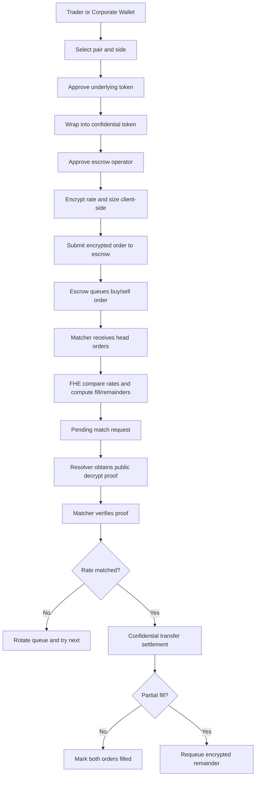

# Blindspot

Confidential FX settlement and cross-border payment matching on FHEVM.

Blindspot is an FHE-powered dark-pool rail for settling large FX-style orders without revealing trade size or limit price to the market before execution. A corporate, treasury desk, or liquidity provider submits encrypted order parameters; the matching engine compares encrypted bids and offers with TFHE/FHEVM operations, computes encrypted fill amounts and encrypted remainders, and settles through confidential ERC-20 wrappers.

The core idea: public blockchains should verify settlement, not leak the order book.

## Why This Matters

Cross-border payments and corporate FX execution often expose enough pre-trade information for liquidity providers, market makers, or intermediaries to infer intent and shade prices. Large visible order sizes can move the market before the trade is complete.

Blindspot removes the most sensitive values from public view:

- order size is encrypted,
- target or limit rate is encrypted,
- fill-size arithmetic happens under FHE,
- partial-fill remainders are requeued without revealing the original or remaining amount,
- settlement is verifiable while numeric trade intent stays confidential.

## What Is Implemented

The current codebase implements a working FHEVM dark-pool model on Ethereum Sepolia:

- client-side encryption using `@zama-fhe/relayer-sdk`,
- encrypted buy and sell order submission,
- confidential ERC-20 wrapper funding,
- FIFO queues per trading pair,
- encrypted price comparison,
- encrypted minimum-size selection,
- encrypted remainder computation for partial fills,
- proof-verified resolver callback using `FHE.checkSignatures`,
- requeueing of partial-fill remainder orders,
- frontend routes for trading, orders, pools, activity, and profile decrypt/unwrap flows,
- Vercel API cron endpoint for resolving pending match requests.

Today the Solidity contracts use `euint64` for encrypted price and size handles. The FX rail framing maps naturally to `encryptedRate` and `encryptedAmount`; moving amount fields to `euint128` is a clear extension path for larger institutional notional values.

## System Flow



## Encrypted Matching Logic

For each buy/sell head pair, the matcher computes:

```solidity
ebool priceMatched = FHE.ge(buyPrice, sellPrice);
ebool buyIsSmaller = FHE.le(buySize, sellSize);
euint64 fillSize = FHE.select(buyIsSmaller, buySize, sellSize);
euint64 sellRemainder = FHE.sub(sellSize, fillSize);
euint64 buyRemainder = FHE.sub(buySize, fillSize);
```

The resolver later decrypts only the match decision and settlement-control values needed for the state transition, with proof verification bound to the exact ciphertext handles. Raw order input handles remain confidential, and partial-fill accounting is produced from encrypted arithmetic rather than plaintext order-book math.

## Partial Fills

Partial fills are the main technical differentiator.

If a buyer wants 10 units and the seller offers 6, the matcher computes the 6-unit fill and a 4-unit encrypted buyer remainder. The original larger order is marked `PartiallyFilled`, a new remainder order is created with the encrypted remainder, and that remainder stays at the queue head for subsequent matching.

This enables multi-round encrypted order-book logic instead of a one-shot private swap.

## Architecture

- `contracts/contracts/DarkPoolEscrow.sol` handles encrypted order intake, queues, escrowed balances, cancellation, settlement transfer calls, and remainder requeueing.
- `contracts/contracts/DarkPoolMatcher.sol` performs FHE comparisons, fill selection, remainder computation, pending request creation, proof verification, queue rotation, and match resolution.
- `contracts/contracts/DarkPoolSettlement.sol` contains the settlement abstraction used by the matcher/pair deployment model.
- `contracts/contracts/DarkPoolFactory.sol` deploys and indexes token wrappers and pair-specific escrow/matcher/settlement contracts.
- `src/lib/fhe.ts` initializes the Zama relayer SDK, encrypts order inputs, and supports user decrypt flows.
- `src/lib/web3.ts` contains browser wallet and contract interaction helpers.
- `src/routes/trade.tsx` implements the funding and encrypted order submission UI.
- `api/resolve-matches.ts` is the cron-safe resolver endpoint that sweeps pending matcher requests and submits proof-backed callbacks.

## Public vs Confidential Data

Confidential:

- order price/rate input,
- order size/amount input,
- fill-size arithmetic before resolution,
- remainder arithmetic,
- confidential token balances,
- user balance reads unless wallet-authorized.

Public:

- wallet addresses,
- pair addresses,
- order IDs,
- transaction hashes,
- lifecycle events,
- whether a pending match ultimately matched,
- clear settlement-control values returned through the proof flow.

This is a pragmatic FHEVM design: it keeps strategy-critical numeric intent private while allowing the chain to verify and progress state.

## Repository Layout

```text
.
|-- api/resolve-matches.ts          # Vercel cron resolver
|-- contracts/                      # Hardhat + FHEVM Solidity workspace
|-- src/                            # React/TanStack frontend
|-- src/lib/fhe.ts                  # Zama relayer SDK integration
|-- src/lib/contracts-config.ts     # Sepolia deployment addresses
|-- vercel.json                     # API deployment config
|-- vercel.frontend.json            # frontend deployment config
|-- README.md                       # project overview
`-- doc.md                          # detailed project documentation
```

## Local Development

Install frontend dependencies:

```bash
npm install
```

Run the frontend:

```bash
npm run dev
```

Build the frontend:

```bash
npm run build
```

Run contracts:

```bash
cd contracts
npm install
npm run build
npm test
```

## Resolver Deployment

The resolver is designed as a separate API deployment because it needs gateway credentials.

Required API environment variables:

- `CRON_SECRET`
- `SEPOLIA_RPC_URL`
- `GATEWAY_PRIVATE_KEY`
- `GATEWAY_ADDRESS`
- `MATCHER_ADDRESSES`
- `MATCHER_MAX_REQUESTS_PER_MATCHER` optional

Cron request:

```text
GET /api/resolve-matches
Authorization: Bearer <CRON_SECRET>
```

Recommended cadence: every minute.

## Current Network

The checked-in frontend configuration targets Ethereum Sepolia and includes deployed pair addresses for:

- WETH/USDC
- WETH/LINK
- LINK/USDC
- DAI/USDC
- WBTC/USDC
- UNI/WETH

## Roadmap

- upgrade encrypted amount fields from `euint64` to `euint128` for larger institutional FX notional ranges,
- add explicit FX pair metadata and corporate payment terminology in the UI,
- support richer order types such as expiry and settlement windows,
- improve resolver observability and retry accounting,
- add invariant tests for queue rotation and multi-round partial fills,
- document production custody, key, relayer, and compliance assumptions.
